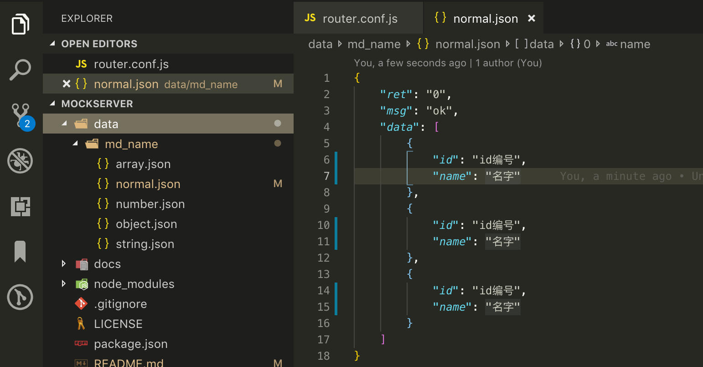
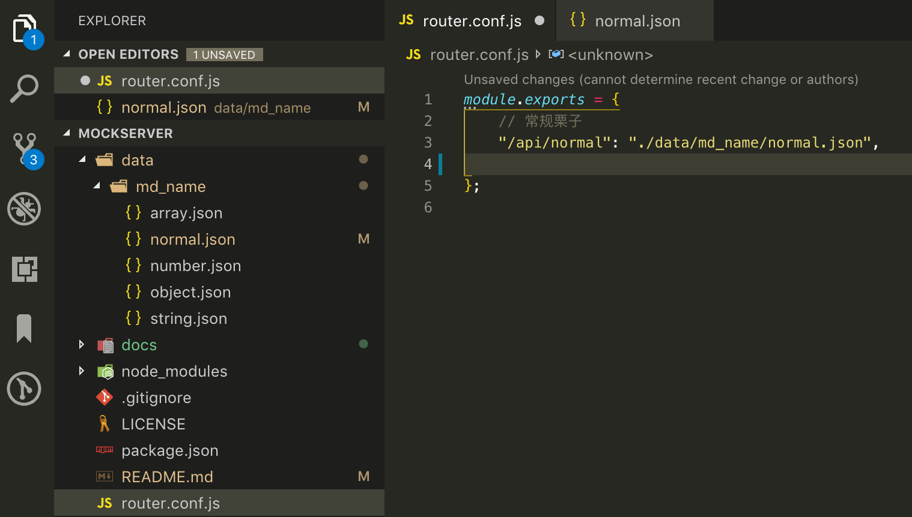
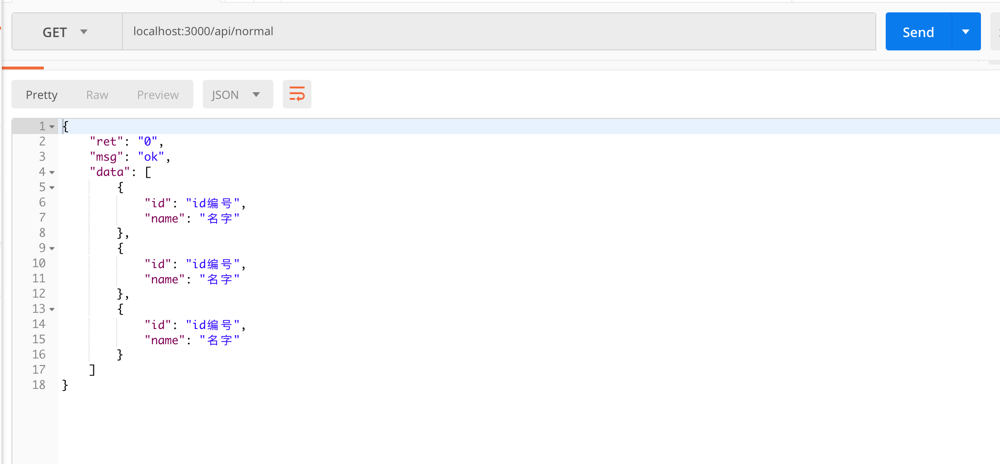
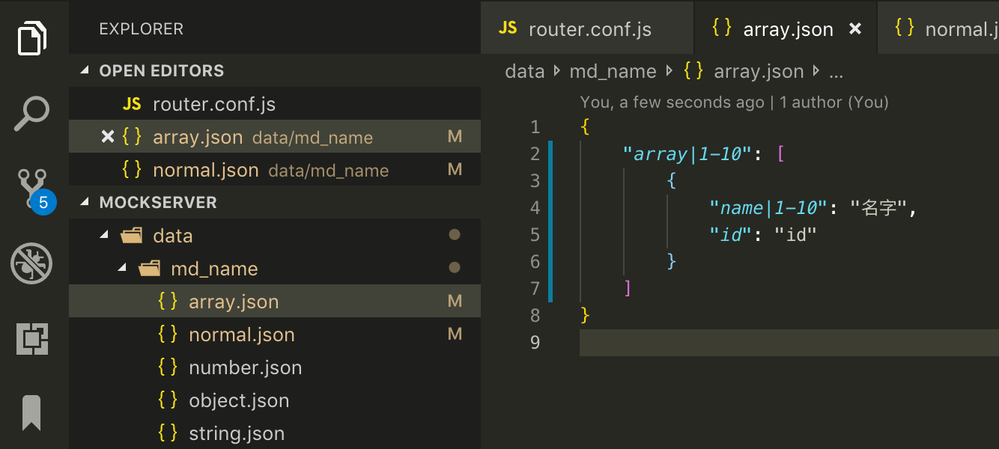

# MockServer

## Introduction

MockServer is a simulation data static service to help the front-end to develop and prototype separate from the back-end progress and reduce some monotony particularly while writing automated tests.

## Quick Start

```shell
git clone git@github.com:influx-code/MockServer.git

npm i

npm run start
```

## example

### 配置端口

默认端口为 3000，可在 server.js 的 init 函数设置端口

### 基本栗子

1.在 data 目录下配置数据源



2.配置接口路由



3.在启动服务的情况下访问接口



### 生成模板数据

**更多语法请参考**`Mock.js`文档(http://mockjs.com/examples.html#Array)

设置模板，配置路由。




## License

MockServer is available under the terms of the [MIT License](./LICENSE).
